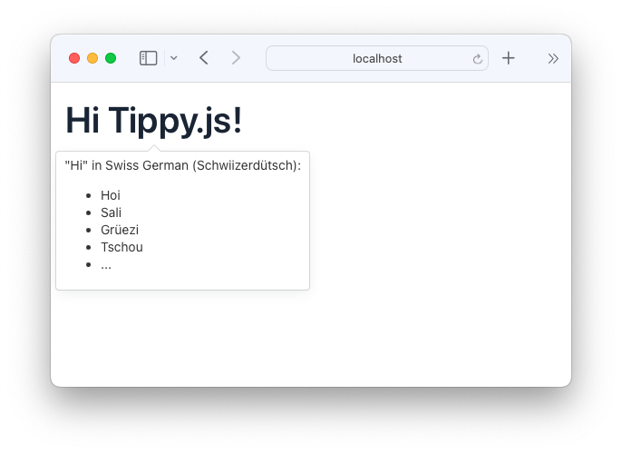

# vaadin-tippyjs

An opinionated sample demo for a [Tippy.js](https://atomiks.github.io/tippyjs/) tooltip with HTML in [Vaadin](https://vaadin.com/docs/latest/).



## Sample usage

```java
@Route("")
class MainView extends VerticalLayout {
  MainView() {
    var h1 = new H1("Hi Tippy.js!");
    TippyJs.forComponent(h1).setHtml("""
        "Hi" in Swiss German (Schwiizerdütsch):
        <ul>
          <li>Hoi</li>
          <li>Sali</li>
          <li>Grüezi</li>
          <li>Tschou</li>
          <li>...</li>
        </ul>
        """.stripIndent());
    add(h1);
  }
}
```

## Run

```shell
./gradlew build bootRun
```

## Used versions 

- Java 21
- Vaadin 24
- Spring Boot 3

## Links

Here some links to resources, which inspired me:

- https://vaadin.com/directory/component/tooltips4vaadin
- https://vaadin.com/blog/integrate-jquery-into-vaadin-flow

